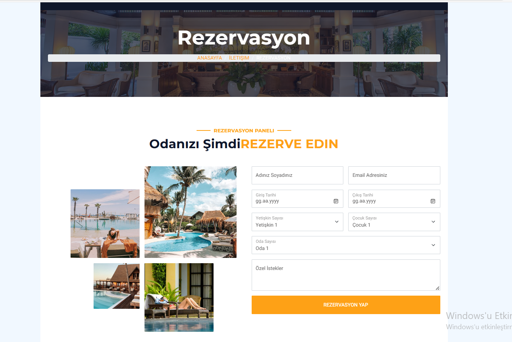
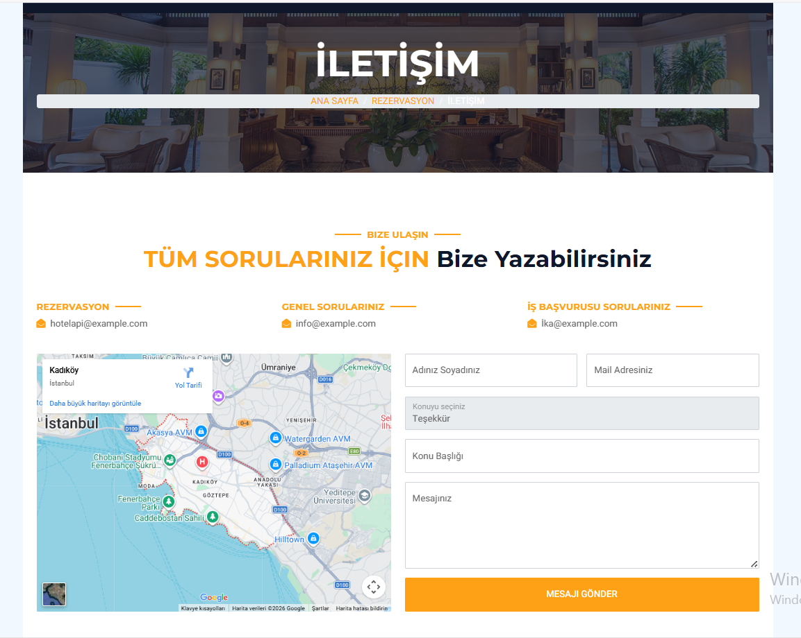
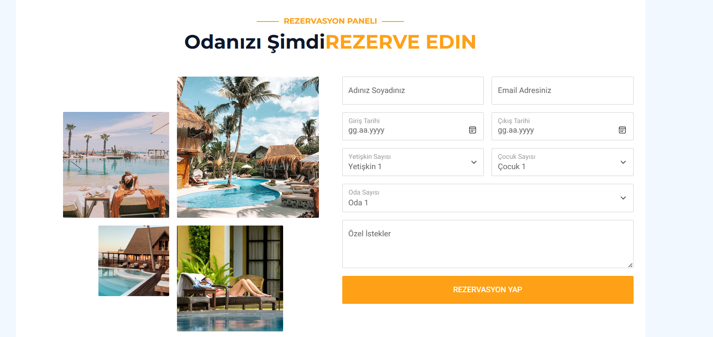
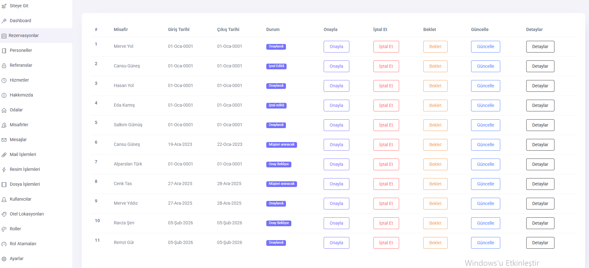
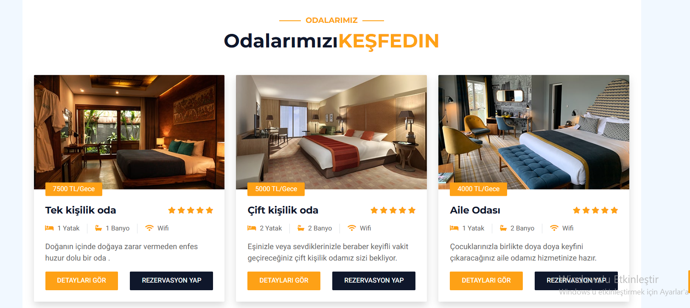
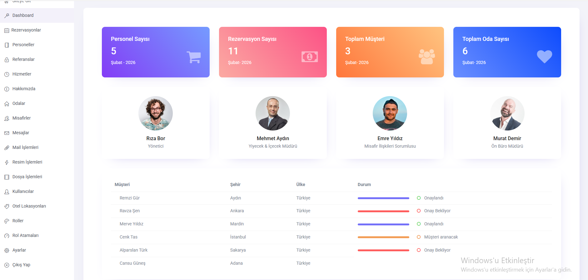
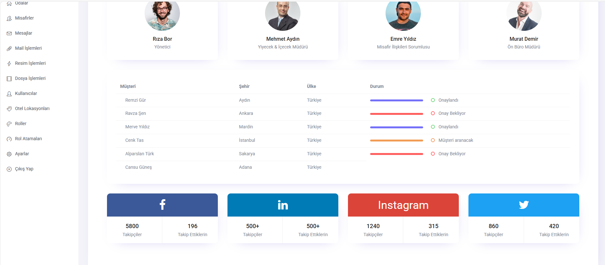
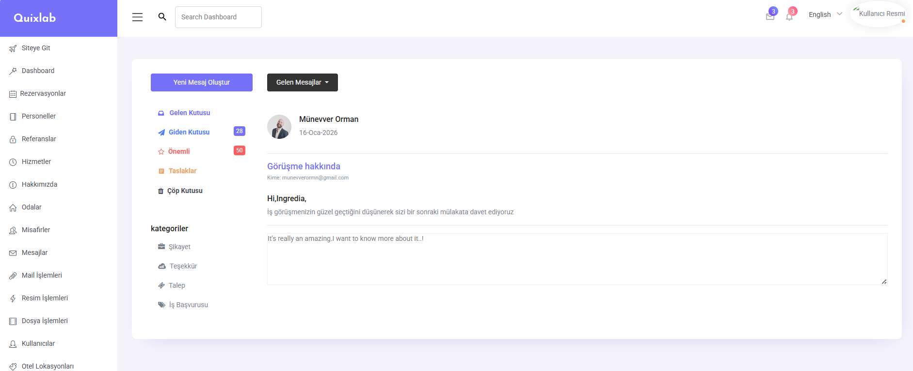
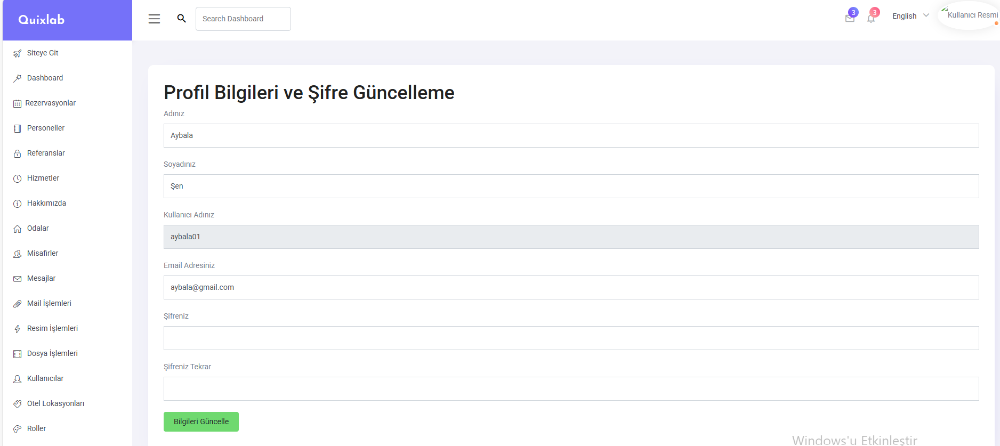

🏨 Otel Rezervasyon Projesi

 📌 Proje Açıklaması
 
Bu proje ASP.NET Core kullanılarak geliştirilmiş API tabanlı bir otel rezervasyon sistemidir.  
Modern web uygulamalarında yaygın olarak kullanılan backend–frontend ayrımını esas alır ve frontend tarafında API consume edilerek çalışır.

Backend tarafı tamamen ASP.NET Core Web API ile geliştirilmiş frontend tarafında ise ASP.NET Core MVC kullanılarak API üzerinden veri tüketimi sağlanmıştır.

🎯 Proje Amacı

Bu projenin temel amacı;

🔗 API tabanlı mimariyi gerçek bir senaryo üzerinde uygulamak 

🧠 ASP.NET Core Web API ile backend geliştirme pratiği kazanmak 

🖥 MVC üzerinden API Consume mantığını kavramak  

🔐 Güvenli kimlik doğrulama süreçlerini uygulamak  

🧩 Katmanlı mimari ve temiz kod yapısını benimsemektir  

 🚀 Öne Çıkan Özellikler

⚙ Backend tarafında tamamen ASP.NET Core Web API mimarisi  

🔄 Frontend tarafında ASP.NET Core MVC ile API Consume  

🔐 JWT (Json Web Token) ile kimlik doğrulama ve yetkilendirme  

👤 ASP.NET Identity ile kullanıcı yönetimi  

🧪 Swagger & Postman ile API test süreçleri  

🌐 Rapid API entegrasyonu  

🧱 N Tier Architecture** ve DTO Layer kullanımı  

🗄 MSSQL veritabanı ve Entity Framework Core  

🧑‍💼 Admin ve 👥 kullanıcı panelleri  

✉ Mail gönderme işlemleri  

🛠 Kullanılan Teknolojiler
💻 ASP.NET Core 5.0  

🌐 ASP.NET Core Web API  

🖥 ASP.NET Core MVC  

🗃 Entity Framework Core  

🛢 MSSQL  

👤 ASP.NET Identity  

🔑 JWT (Json Web Token)  

✅ Fluent Validation  

📘 Swagger 

📮 Postman 

🌍 Rapid API  

🧩 Repository Design Pattern  

🧱 N Tier Architecture  

📦 DTO Layer  

📸 Ekran Görüntüleri

🔹 Banner

🔹 Booking

🔹 Contact

🔹 Reservation

🔹 Reservation List

🔹 Room

 🔹 Dashboard

🔹 Dashboard 2

🔹 Mail

🔹 Settings

